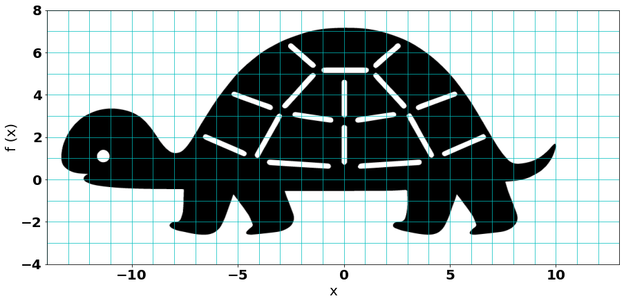
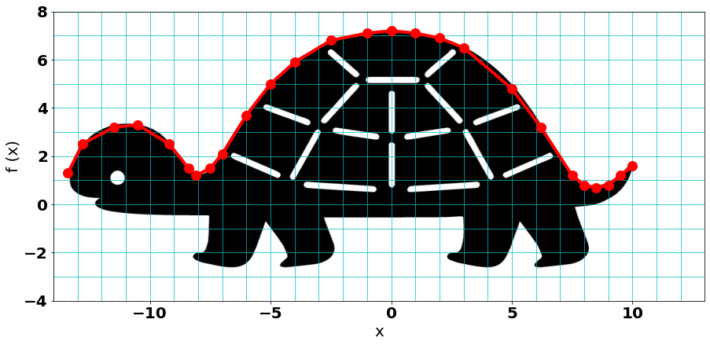
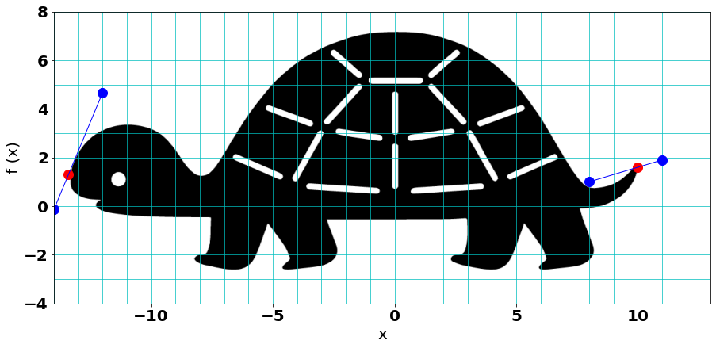
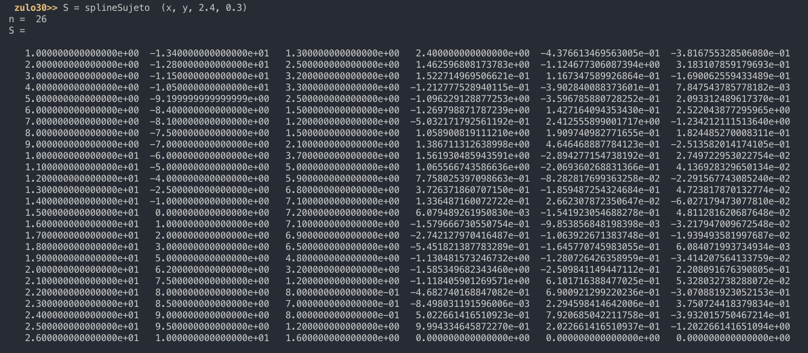
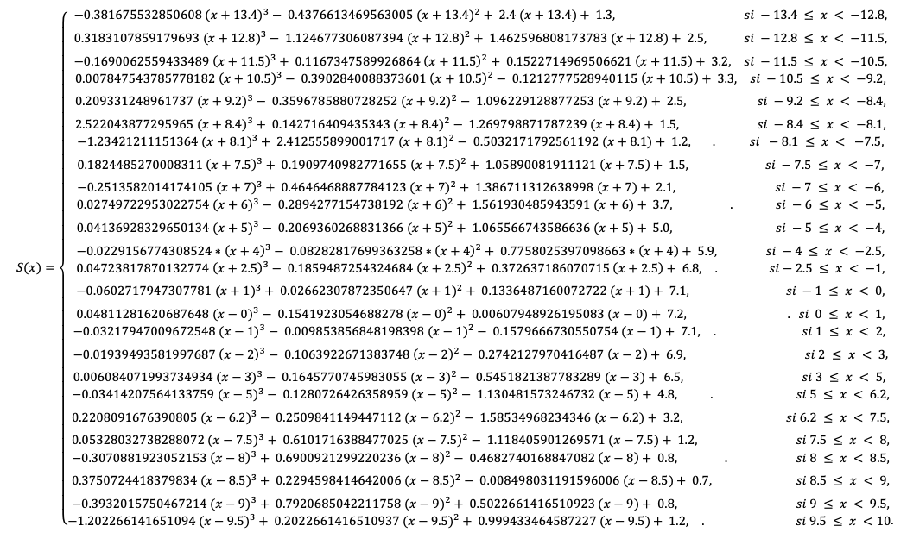
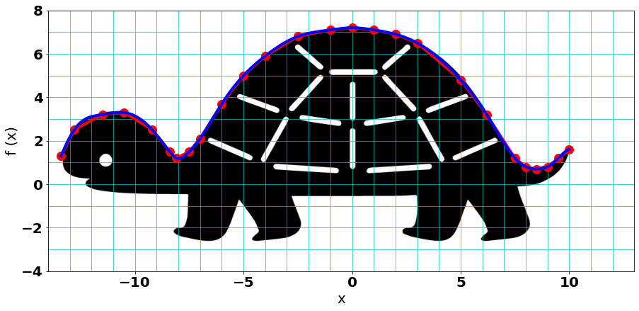

## Resumen
El presente de trabajo consiste en la validación del método de interpolación a través del uso de splines cúbicos como una herramienta de gran ayuda para describir el comportamiento de una variable de interés y con ello conocer el comportamiento que esta tiene.

La interpolación por su parte consiste en un método de aproximación de un valor desconocido del cual se tiene se quiere obtener más información, del cual se conoce un intervalo en el cual este puede variar. Es por ello que a través de los splines podemos realizar una aproximación más precisa del dato de interés, ya que este método proporciona un mejor ajuste al unir varios puntos teniendo en cuenta la suavidad en las intersecciones y la agrupación de la información de los subintervalos que describen cierta concavidad los cuales son muy importantes a la hora de analizar el comportamiento de la variable.[@burden_alisis_2017]

De esta manera al realizar la selección de datos que posiblemente describen el comportamiento de la curva que se quiere obtener, se evidenció que utilizando el método de interpolación a través de los splines cúbicos se tiene una precisión muy alta respecto al comportamiento original de la variable, por lo cual se convierte en una herramienta de gran ayuda al momento de validar un modelo y/o conocer el comportamiento de una variable de la cual se tiene poca información y de esta manera tener más argumentos a la hora de tomar una decisión.[@eaton_gnu_2019]

	Palabras Clave:  Splines Cúbicos, Octave, Interpolación.

## Introducción
En la formación integral que proporciona la academia a los ingenieros, se les enseña a interpretar el comportamiento que tiene una función matemática con el fin de entender sus posibles variaciones y con ello tener más herramientas a la hora de tomar decisiones. Sin embargo, no siempre se tiene una función específica para modelar dicho comportamiento 	y es allí donde se utilizan otras herramientas o métodos para llevar a cabo el análisis de la situación que es objeto de estudio.[@bartamarabara_silueta_nodate]

Es por ello que la interpolación de datos se convierte en una ayuda fundamental al momento de predecir el comportamiento que puede tener la variable de interés, por lo cual el objetivo del presente trabajo consistirá en validar la funcionalidad de esta herramienta a través del uso de Splines Cúbicos Sujetos y un algoritmo de programación en el software Octave, los cuales nos permitan validar si la variable de interés  se ajusta al comportamiento esperado a partir de una serie de datos previamente recolectados.[@castano_introduccion_nodate]

## Desarrollo 
Para llevar a cabo la construcción del modelo y con ello el desarrollo del proyecto se realizaron una una serie de pasos:

En primer lugar, se seleccionó la imagen con la cual se iba a realizar la validación del método a través de la modelación de la silueta (ver Figura 1). Para ello debíamos crear una función que describiera la forma de la figura, por lo cual se utilizó solo la parte superior del contorno de la imagen, es decir desde el extremo izquierdo correspondiente a la cabeza de la tortuga hasta el extremo derecho de su cola. 

Figura 1. Silueta de una Tortuga Vectorizada.[6] 

Luego se procedió a realizar un bosquejo del dibujo en una hoja milimetrada ( ver Anexo 2), en donde se trazó un eje coordenado como el que se puede apreciar en la Figura 2 en el cual se le asignaron coordenadas (X,Y) a cada uno de los puntos que describen el comportamiento de la curva correspondiente a la parte superior del dibujo.[@hunter_matplotlib_2007]

Figura 2. Silueta con ejes coordenados.

Para tratar de obtener la mayor precisión al trasladar el dibujo (ver Anexo 2) en forma digital se agregó a la figura 1 una cuadrícula con cotas en la misma escala y posición que se utilizó en la hoja milimetrada para validar el resultado del spline frente a la imagen original.

Posteriormente al momento de seleccionar los puntos que describen dicho comportamiento, se tuvieron en cuenta las partes de la silueta en donde se evidenciara un mayor cambio o curvatura, en las cuales se tomaron un mayor número de puntos con el fin de simular con más precisión la variación de la curva en la silueta y con ello que el spline se ajuste mejor a su comportamiento. 
A continuación se presentan en la Tabla 1 los datos correspondientes a los puntos seleccionados para la descripción del comportamiento de la curva que hace referencia a la parte superior de la silueta.[@]

Tabla 1. Tabla de puntos de la curva.
 

Adicionalmente, se muestra en la Figura 3 una representación de los 26 puntos que fueron seleccionados para realizar el spline y su correspondiente posición sobre la curva.

Figura 3. Representación de los puntos 
seleccionados sobre la silueta.
Posteriormente, con el fin de sacar las condiciones a las cuales el spline está sujeto se procedió a sacar las rectas tangentes a los extremos de la figura y con la ecuación de la pendiente cuando se poseen 2 puntos, se procedió al cálculo de las respectivas inclinaciones,  estas con el fin de condicionar el spline. De allí, se determinó:   f’(x0) = f’( -13.4) = 2.4  y   f’(xn) = f’(10) = 0.3.

Figura 4. Rectas tangenciales en los extremos curva.

Para la construcción del spline cúbico interpolante se pasó a transcribir el pseudocódigo del algoritmo 3.5 del libro de Burden  (pág. 115) [1] a “GNU Octave”, un lenguaje de alto nivel principalmente destinado para cálculos numéricos ( ver Anexo 1). 
El código recibe cuatro parámetros de entrada: El primero es un arreglo con las coordenadas X y el segundo también es un arreglo, pero con las coordenadas Y de los puntos anteriormente seleccionados. Además se pasan los valores de condiciones del spline sujeto, como se puede apreciar en la figura 5. 

Figura 5. Parámetros para la ejecución del programa en octave.

La función “splineSujeto” retorna una matriz solución con los coeficientes de las funciones que representan el comportamiento de la curva en cada uno de los subdominios del spline interpolante como se puede observar en la figura 6.

Figura 6. Matriz solución del programa en octave.

Es así, como fueron utilizados cada uno de los coeficientes obtenidos en la matriz solución, las cuales se pueden observar de claramente en la tabla 2. 

Tabla 2. Tabla de coeficientes del spline cúbico condicionado.

Por consiguiente, se construye la función por tramos que describe el comportamiento del perfil superior de la imagen de la tortuga, utilizando la siguiente ecuación:

Por lo tanto, se llegó a la función por tramos la cual consiste de 25 subintervalos como se muestra en la figura 7,  que representa el spline cúbico sujeto. 

Figura 7. Función por tramos que describe el
 comportamiento de la curva.  

Por último, se grafica el spline cúbico condicionado sobre la silueta original para comparar cómo se aproxima la curva al contorno de imagen. como se muestra en la figura 8.

Figura 8. Comparación de la silueta original con los datos
 vs. el spline cúbico hallado.

## Resultados y Conclusiones

* Utilizando el método de interpolación a través de splines cúbicos, se puedo evidenciar una que este ofrece una precisión muy alta al momento de graficar la curva resultante y compararla con la original, ya que esta se ajusta muy bien. Por lo cual este método se convierte en una herramienta muy útil a la hora de validar un modelo y/o conocer el comportamiento de una variable de interés, de la cual se tiene poca información.

* Es importante que al momento de utilizar este método se tenga la mayor cantidad de puntos posibles sobre la curva de la cual se quiere realizar el análisis, ya que entre más puntos se tengan mejor será el ajuste que proporciona el spline y de esta manera se obtendrá una mayor precisión.

* Resulta de gran importancia que se seleccionen puntos que ofrezcan información significativa para la modelación de la curva, ya que si no se tienen datos referentes a aspectos importantes como los cambios de concavidad, puede que no se obtenga un comportamiento preciso de la variable de interés.

## Bibliografía

